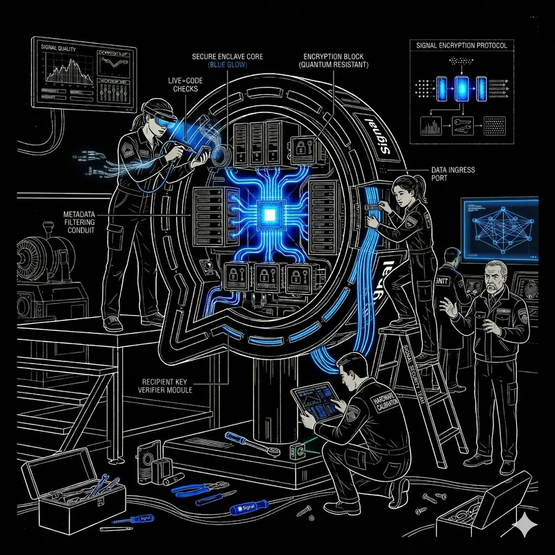
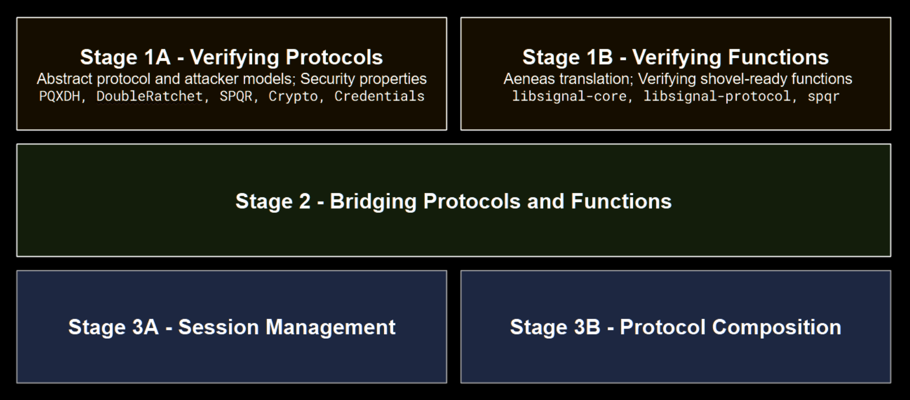
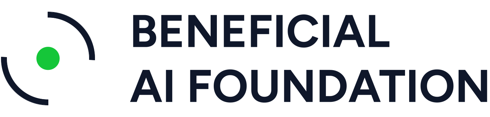
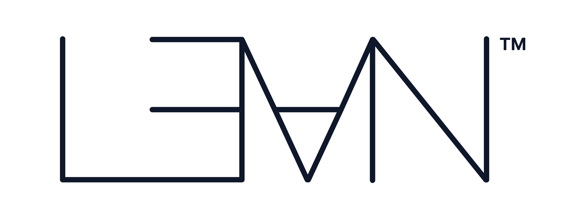

<p align="center">
  
</p>

<h1 align="center">Signal Shot</h1>

<p align="center">
  <em>Formally verify the Signal protocol and the Signal app with Lean.</em>
</p>

<p align="center">
  <a href="LICENSE"></a>
  <a href="https://leanprover.zulipchat.com/#narrow/channel/583276-Signal-Shot"></a>
  <a href="https://www.beneficialaifoundation.org/signal-shot"></a>
  
  
</p>

---

## About Signal Shot

[**Signal Shot**](https://www.beneficialaifoundation.org/signal-shot) is a moonshot initiative to formally verify the **Signal protocol** and the **Signal app** using the [**Lean theorem prover**](https://lean-lang.org). It is co-led by the [Beneficial AI Foundation](https://www.beneficialaifoundation.org/), [Signal](https://signal.org/), and the [Lean FRO](https://lean-fro.org/), with 20+ academic and industry collaborators — including Cryspen, Stanford, UC Berkeley, Google, and Microsoft.

The project officially launched on **April 20, 2026** at the *Software Verification in Lean* workshop in Paris.

## Why this matters

> *"The broad availability of increasingly capable AI-powered hacking tools makes this project very timely."*

Signal Shot has three intertwined goals:

- 📐 **A reference for shipping verified software.** Build tools not just for end-to-end machine-checking of full protocol stacks, but also for designing new protocols and for continuous verification as the software evolves.
- 🚀 **Catalyze software verification in Lean.** Improve required tooling and performance, bring together the Lean verification ecosystem, and connect AI-assisted formalization and theorem proving to software verification.
- 🛡️ **Build capabilities for AI safety.** Scale up software verification through AI tools, open-source software, and open standards — a virtuous cycle where better AI tools drive verification adoption, which produces more verified code to train still better AI tools.

## How the project is organized

Signal Shot runs along **two parallel, complementary tracks**. Most contributors find one a more natural fit than the other; both feed into the same end goal.

<p align="center">
  
</p>

<table>
<tr>
<td width="50%" valign="top">

### 🔬 Functional Correctness

Verify that Signal's **Rust implementations** match their specifications. We translate the Rust source into Lean using [Aeneas](https://github.com/AeneasVerif/aeneas) and prove that the translated code satisfies its spec.

*If you enjoy reading code and pinning down what it actually does, start here.*

</td>
<td width="50%" valign="top">

### 🛡️ Protocol Security

Formalize the **cryptographic protocols** Signal uses as mathematical models and prove their security properties — secrecy, authenticity, forward secrecy, post-compromise security, and more.

*If you enjoy cryptography, security definitions, and reduction proofs, start here.*

</td>
</tr>
</table>

## Where to contribute

Pick the repository whose subject matches your interests and expertise. Each one has its own `README`, `CONTRIBUTING`, and open issues.

### 🔬 Functional Correctness

| Repository | Verifies | Status |
|---|---|:---:|
| [**curve25519-dalek-lean-verify**](https://github.com/Beneficial-AI-Foundation/curve25519-dalek-lean-verify) | The `curve25519-dalek` elliptic-curve cryptography library | ✅ Completed |
| [**SparsePostQuantumRatchet-verify**](https://github.com/Beneficial-AI-Foundation/SparsePostQuantumRatchet-verify) | The Sparse Post-Quantum Ratchet (SPQR) implementation | 🟢 Active |
| **libsignal-verify** | Signal's `libsignal` core library | 🚧 Coming soon |

### 🛡️ Protocol Security

| Repository | Models | Status |
|---|---|:---:|
| [**secure-messaging**](https://github.com/Beneficial-AI-Foundation/secure-messaging) | CKA, SCKA, Double Ratchet, Triple Ratchet, and SPQR secure-messaging protocols (built on [VCVio](https://github.com/Verified-zkEVM/VCV-io)) | 🟢 Active |
| [**PostQuantumeXtendedDiffieHellman-model**](https://github.com/Beneficial-AI-Foundation/PostQuantumeXtendedDiffieHellman-model) | The PQXDH key-agreement protocol — with a [live Verso blueprint](https://beneficial-ai-foundation.github.io/PostQuantumeXtendedDiffieHellman-model/) | 🟢 Active |
| [**KeyedVerificationAnonymousCredential-model**](https://github.com/Beneficial-AI-Foundation/KeyedVerificationAnonymousCredential-model) | The Keyed-Verification Anonymous Credential (KVAC) framework with the μCMZ and μBBS instantiations | 🟢 Active |

> 🚧 **"Coming soon"** repositories are under active scaffolding and will be opened publicly once they are ready for outside contributions. Watch the Zulip [`#announcements`](https://leanprover.zulipchat.com/#narrow/channel/583276-Signal-Shot) topic for updates.

## How to contribute

```
   1. Pick a project   →   2. Read its docs   →   3. Join Zulip   →   4. Open an issue or PR
```

1. **Pick a project** from the tables above whose topic matches your background.
2. **Read its docs.** Every repository has a `README`, and most have a `CONTRIBUTING.md`, a `TRACKS.md`, or a similar status board describing what's currently being worked on and how to claim a task.
3. **Join the [Zulip channel](https://leanprover.zulipchat.com/#narrow/channel/583276-Signal-Shot)** to introduce yourself, ask questions, and coordinate with other contributors before starting non-trivial work.
4. **Fork the repository, then open a PR.** Push your branch to your own fork and open a pull request back to the upstream `main`. Look for `good first issue` labels where available, and check in on Zulip before tackling larger pieces.
    > 🔀 **Why fork?** Branches in the upstream Signal Shot repositories are reserved for maintainers. External contributors should always work from a fork — this keeps the upstream branch list clean and is the standard open-source workflow. New to forking? See GitHub's [contributing to a project](https://docs.github.com/en/get-started/quickstart/contributing-to-projects) guide.

### Who we're looking for

Signal Shot needs contributors from across the verification ecosystem:

- 🧮 **Cryptographers & mathematicians** — formalize protocols, write security definitions, design reduction proofs.
- 🦾 **Lean / formal-methods practitioners** — write specs, complete proofs, sharpen tactics and tooling.
- 🦀 **Rust engineers** — bridge implementations and verification through Aeneas; help annotate and shape the source.
- 🤖 **AI / theorem-proving researchers** — improve AI-assisted formalization, tactic synthesis, and proof search.
- 📚 **Writers, educators, & designers** — improve documentation, blueprints, tutorials, diagrams.
- 🐛 **Everyone else** — file issues, share feedback, and welcome newcomers in `#beginners`.

> *No question is too basic. The community aims to be rigorous and welcoming in equal measure.*

## Review process

Once a PR is opened it goes through a **multi-stage review**. Specifications and proofs follow parallel pipelines with slightly different bars — specifications require thorough documentation and external review, while proofs lean more heavily on automated checks and can be fast-tracked when small.

<table>
<tr>
<th align="center">📄 Specifications (protocols / functions)</th>
<th align="center">🔐 Proofs (protocols / functions)</th>
</tr>
<tr>
<td valign="top" width="50%">

1. **Issue created** — new or existing (e.g. *"Formalize Theorem X in paper"*)
2. **PR received**
   - Documentation **required** to make review easy
   - Reserved right to reject the PR immediately if it is AI slop
3. **AI review**
   - Compared against the original papers
   - Compared against the intent of the Rust source
   - Concerns flagged at high / medium / low levels
4. **BAIF review** — PR author asked to address concerns
5. **Collaborator review**
   - Initial review by a collaborator
   - Additional review by an external reviewer
6. **Signal review**
7. **BAIF approval**

</td>
<td valign="top" width="50%">

1. **Issue created** — new or existing (e.g. *"Prove Theorem X in paper"*)
2. **PR received**
   - Documentation recommended (but not required)
   - Reserved right to reject the PR immediately if it is AI slop
3. **AI review**
   - Transpilers and compilers run
   - Checked for potential proof-cheats
   - Concerns flagged at high / medium / low levels
4. **BAIF review**
   - Specs must already have been validated
   - Proof script length proportionate — split into smaller lemmas if needed
   - Proof script robust to small changes in definitions, specs, and implementations
5. **Collaborator review** — *may be skipped for simple submissions*
6. **Signal review** — *may be skipped for simple submissions*
7. **BAIF approval**

</td>
</tr>
</table>

## Community

All discussion, coordination, and announcements happen on the **Signal Shot Zulip channel** on the Lean Prover server.

<p align="center">
  <a href="https://leanprover.zulipchat.com/#narrow/channel/583276-Signal-Shot">
    
  </a>
</p>

Key topics:

- [`#introductions`](https://leanprover.zulipchat.com/#narrow/channel/583276-Signal-Shot) — say hi, tell us your background, and what brought you here.
- [`#beginners`](https://leanprover.zulipchat.com/#narrow/channel/583276-Signal-Shot) — for any question, no matter how basic.
- [`#announcements`](https://leanprover.zulipchat.com/#narrow/channel/583276-Signal-Shot) — project updates and milestones.
- Per-project topics for deeper technical discussion.

> 🔒 **Reporting a Signal app vulnerability?** Signal Shot is a verification effort. For security issues in the Signal app itself, please use Signal's official channel: [`security@signal.org`](mailto:security@signal.org).

## Leadership & collaborators

**Steering Co-Chairs**

- **Max Tegmark** — President, Beneficial AI Foundation
- **Leonardo de Moura** — Chief Architect, Lean FRO; Senior Principal Applied Scientist, AWS

**Core team:** Shaowei Lin · Rolfe Schmidt · Sofia Lanfri · Mikhail Asavkin · Armin Vrevic · Thiago Silva · Oliver Butterley · Filippo A. E. Nuccio

**Contributors:** Research experts who advise event organization and review code submissions. [See List](https://www.beneficialaifoundation.org/signal-shot#:~:text=ORGANIZERS-,COLLABORATORS,-Karthik%20Bhargavan%2C).

<p align="center">
  <a href="https://www.beneficialaifoundation.org/">
    <picture>
      <source media="(prefers-color-scheme: dark)" srcset="assets/baif-logo.webp">
      
    </picture>
  </a>
  &nbsp;&nbsp;&nbsp;&nbsp;
  <a href="https://signal.org/"></a>
  &nbsp;&nbsp;&nbsp;&nbsp;
  <a href="https://lean-fro.org/">
    <picture>
      <source media="(prefers-color-scheme: dark)" srcset="assets/lean-logo.webp">
      
    </picture>
  </a>
</p>

## Learn more

- 🌐 **Project page** — <https://www.beneficialaifoundation.org/signal-shot>
- 📝 **Intro blog post** — [*Signal Shot: One Giant Lean for Protocol Security*](https://www.beneficialaifoundation.org/blog/signal-shot)
- 🎤 **Slides** — see [`slides/`](slides/) in this repository.
- 📅 **Launched** — April 20, 2026 at the *Software Verification in Lean* workshop, Paris.

## License

This repository is licensed under the [MIT License](LICENSE). Each linked sub-project carries its own license — see the repository's own `LICENSE` file for details.
